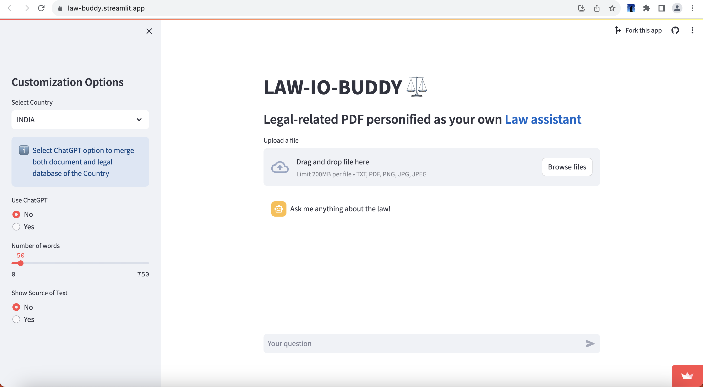
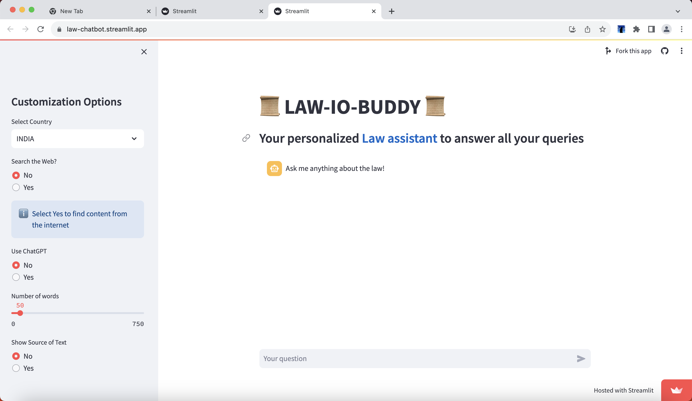

# LAW-IO-BUDDY
---
## Your personalized Law assistant to answer all your queries

LAW-IO-BUDDY is your interactive legal research assistant which can interact with PDFs, websites, web searches etc
. Combine external PDFs with Legal Documents or search the internet, or combine all of the above features for an interactive legal research.

LAW-IO-BUDDY is a legal assistance tool which provides three main features followed by several customization options to enhance legal research. 

1. *_Web Extension to Interact/query websites_* - This tool is an interactive Web Extension for google chrome which can scrape all the text from the website to interact with it. Users can ask questions related to the webpage to get concise answers through ChatGPT. The scraped data is first stored in Vectara and using a combination of Semantic Search and ChatGPT, the user can get answers to all their queries in the webpage.

2. *_Question & Answer with Documents_* - Using an interactive webpage developed on streamlit, the user can upload their files to query upon them. But this gets even better when the user selects the customization options, the user can query with their documents while combining the information from their documents with legal documents of multiple countries to get concise information to verify if their document related query is resolvable by the Legal Database of the country. Moreover, they can select the length of the output as well find the source of the answer in the document. 

3. *_Legal Chatbot_* - The final piece to the ultimate legal research assistant, the legal chatbot can answer any law/legal questions from its database of various constitutional and legal documents stored in its database. It also has multiple customization options, which include "Search the Web", which is a novel feature which can combine web related searches to legal documents to provide accurate answers to user queries. Moreover the user can also select the length of answer while checking its source.

## Product Screenshots

1. Web Extension 
    

3. Legal Chatbot
    

4. Document Q&A
    

Overall, LAW-IO-BUDDY is the ultimate legal research assistant which can boost the speeds of users during research whilst also being a beginner friendly platform to accommodate users who are unaware about the intricate aspects of certain laws. The 2nd and 3rd features can also run as standalone webpages.
